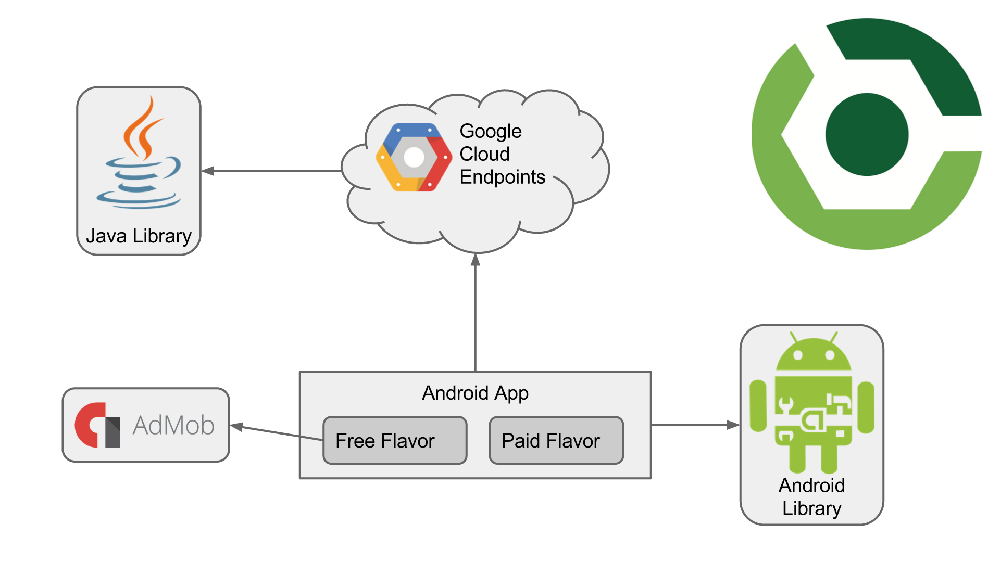

# Build It Bigger

As Android projects grow in complexity, it becomes necessary to customize the behavior of the Gradle build tool, allowing automation of repetitive tasks. Particularly, factoring functionality into libraries and creating product flavors allow for much bigger projects with minimal added complexity.

## Project Overview

In this project, I created an app with multiple flavors that uses multiple libraries and Google Cloud Endpoints. The app consists of four modules:

1. A Java library that provides jokes
2. A Google Cloud Endpoints (GCE) project that serves those jokes
3. An Android Library containing an activity for displaying jokes
4. An Android app that fetches jokes from the GCE module and passes them to the Android Library for display

## Implemention 

The following requirements have been implemented.

1. Project contains a Java library for supplying jokes
2. Project contains an Android library with an activity that displays jokes passed to it as intent extras.
3. Project contains a Google Cloud Endpoints module that supplies jokes from the Java library. Project loads jokes from GCE module via an async task.
4. Project contains connected tests to verify that the async task is indeed loading jokes.
5. Project contains paid/free flavors. The paid flavor has no ads, and no unnecessary dependencies.
6. App retrieves jokes from Google Cloud Endpoints module and displays them via an Activity from the Android Library.
7. The free app variant displays interstitial ads between the main activity and the joke-displaying activity.
8. The app displays a loading indicator while the joke is being fetched from the server.
9. The root build.gradle file contains a task that will start up the GCE dev server, run all Android tests, and shutdown the dev server.
